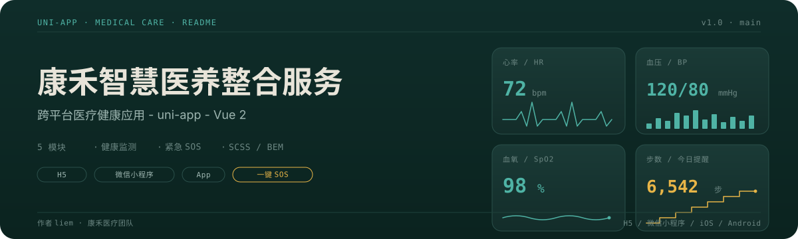
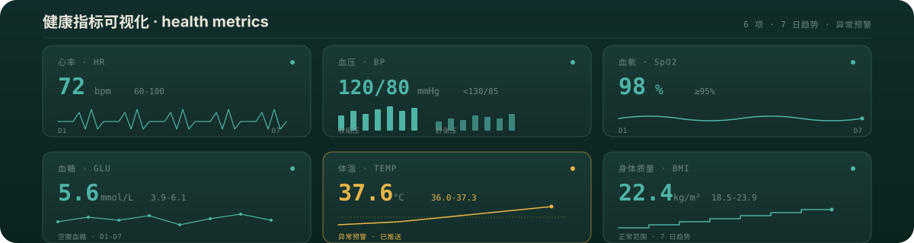
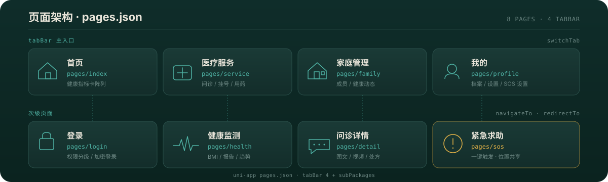
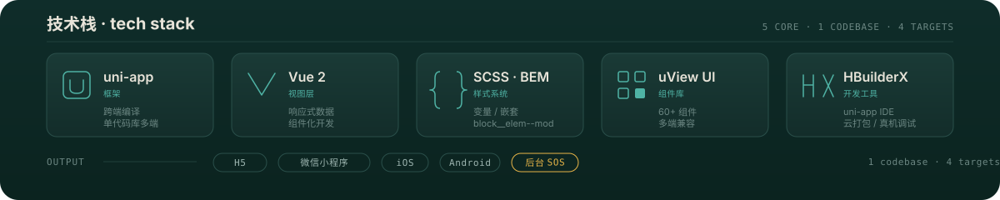
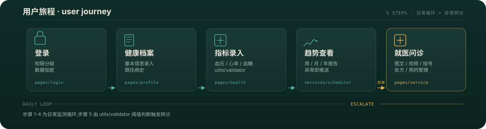
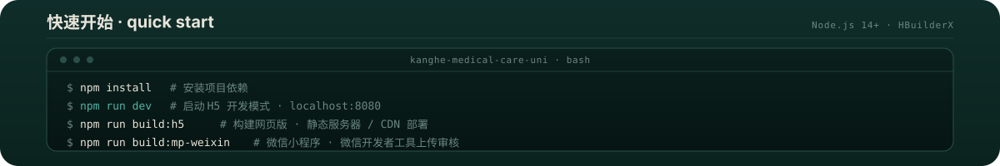

<p align="center">
  
</p>

## 健康指标,一屏可见

康禾首页以**健康指标卡阵列**呈现核心生命体征:心率、血压、血氧、步数,每张卡片配数值与迷你趋势线,异常即时由琥珀色提醒。指标数据由 `services/medical` 层采集,经 `utils/validator` 校验后回流至 `components/health-card` 渲染。这不是装饰图,而是产品首页的原生 UI 缩影。

<p align="center">
  
</p>

## 五大功能模块

| 模块 | 入口 | 关键能力 |
| --- | --- | --- |
| 用户认证 | `pages/login` | 登录态 / 权限分级 / 数据加密 `utils/encrypt` |
| 健康数据 | `pages/index` `pages/health` | 实时监测 / BMI 评估 / 周月年报告 |
| 医疗服务 | `pages/service` | 图文视频问诊 / 预约挂号 / 用药管理 / 健康档案 |
| 家庭管理 | `pages/family` | 成员管理 / 健康动态 / 用药提醒 |
| 紧急服务 | `services/sos` | 一键 SOS / 位置共享 `utils/locator` / 健康预警 |

<p align="center">
  
</p>

## 这是什么

康禾智慧医养整合服务平台是一套基于 **uni-app (Vue 2)** 的跨平台医疗健康管理应用,面向老年人与慢性病患者,提供从日常健康监测到紧急求助的全链路医养服务。

## 为什么不同

- **一套代码,多端覆盖** - uni-app 单一代码库同时输出 H5、微信小程序、App 三端,医疗业务逻辑只需实现一次。
- **健康指标卡阵列原生 UI** - 首页直接以心率 / 血压 / 血氧 / 步数卡片承载核心数据,医疗信息密度高,符合医养场景的"仪表盘"心智,而非通用首页模板。
- **紧急服务内嵌,而非外挂** - `services/sos` 与 `utils/locator` 协同,一键求助即触发位置共享与健康预警,把"急救"做成产品级能力而非第三方跳转。
- **分层清晰** - components / pages / services / utils 四层职责分明,医疗业务(services)与平台能力(utils)解耦,便于在医院、社区、家庭不同部署形态下复用。

## 页面架构

<p align="center">
  
</p>

### 分层架构

```
┌─────────────────────────────────────────────────────────┐
│  pages      login · index · service · health · family · profile
│             业务页面:健康概览 / 问诊 / 监测 / 家庭 / 我的
├─────────────────────────────────────────────────────────┤
│  components  doctor-card · health-card · auth · modal
│              医疗专用组件 + 通用交互组件
├─────────────────────────────────────────────────────────┤
│  services   medical · sos · scheduler
│             医疗流程 / 紧急求助 / 用药与提醒调度
├─────────────────────────────────────────────────────────┤
│  utils      api · util · validator · locator · encrypt
│             接口 / 工具 / 校验 / 定位 / 加密
└─────────────────────────────────────────────────────────┘
```

### 健康监测数据流

```
传感器 / 手动录入
        │
        ▼
 utils/validator  ── 校验阈值与单位
        │
        ▼
 services/medical ── 入库 + 触发评估
        │
        ├─▶ components/health-card   渲染指标卡阵列
        ├─▶ services/scheduler       生成用药 / 复诊提醒
        └─▶ services/sos             越界即推送健康预警
```

## 技术栈

<p align="center">
  
</p>

## 用户旅程

<p align="center">
  
</p>

步骤 1 至 4 为日常监测循环,步骤 5 由 `utils/validator` 阈值判断触发转诊,闭环从监测走向治疗。

## 如何使用

### 环境要求

- Node.js 14+
- HBuilderX 或 uni-app CLI
- 已就绪的后端 API(见下文配置说明)

<p align="center">
  
</p>

### 多端打包

```bash
# H5 网页版
npm run build:h5

# 微信小程序
npm run build:mp-weixin

# App(iOS / Android)
npm run build:app-plus
```

## 配置说明

| 配置项 | 文件 | 说明 |
| --- | --- | --- |
| API 接口地址 | `utils/api.js` | 后端服务 baseURL、请求拦截、错误处理 |
| 地图与定位 | `utils/locator.js` | 地图 key、定位精度、逆地理编码 |
| 应用权限 | `manifest.json` | 各端权限声明(定位 / 相机 / 通知) |
| 数据加密 | `utils/encrypt.js` | 敏感字段加解密密钥与算法 |

### 部署形态

- **H5** - 构建产物部署至任意静态服务器或 CDN,适合医院候诊大屏、微信内分享落地页。
- **微信小程序** - 产物通过微信开发者工具上传审核,适合社区家庭场景。
- **App** - 产物通过 HBuilderX 云打包或本地打包发布,适合需要后台保活 SOS 的高危用户。

## 代码规范

- ES6+ 语法,遵循 Vue 官方风格指南
- 样式使用 SCSS,采用 BEM 命名
- 文件名一律 kebab-case
- 组件 props 必须类型声明,工具函数必须独立可测

<p align="center">
  
</p>

---

联系方式:`liem` · 康禾医疗团队
